# Student Exam Scores Analysis

## Overview
This project analyzes student exam scores using a dataset of students' demographics, parental education levels, lunch types, and test preparation statuses. The goal of this project was to explore how different factors influence overall student performance and to practice SQL for data analysis and Excel for visualization. This project may be on the beginner side, but I believe the experience was invaluable. I shared all my queries via Sqlite by screenshots, because I feel that is a great way to show the visual database process.

This project is part of my data analytics learning journey, and I used this opportunity to recap the tools, techniques, and insights I gained.

## Dataset
The dataset used for this project is publicly available on Kaggle:  
[Students Exam Scores Dataset](https://www.kaggle.com/datasets/desalegngeb/students-exam-scores)

- **Author**: Desalegn Geb  
- **Description**: This FICTIONAL dataset contains student demographic and exam score data, including:
  - **Gender**: Gender of the student.
  - **Ethnic Group**: The student's ethnic background.
  - **Parental Education**: The highest education level completed by a parent.
  - **Lunch Type**: The type of lunch received by the student (standard or free/reduced).
  - **Test Preparation**: Whether the student completed a test preparation course.
  - **Math, Reading, Writing Scores**: Exam scores in three subjects.

---

## Project Steps

### **Step 1: Define Objectives**
1. Import data into the database(first time using one locally!).
2. Showcase SQL abilities and techniques to analyze data.
3. Explore patterns in the dataset.
4. Use SQL for simple data cleaning, summarizing, and querying.
5. Create visuals to showcase insights.

---

### **Step 2: Objective Questions Answered**
1. **What type of impact is there for test preparation on exam scores?**
   - Analyzed how test preparation affects student performance across subjects.
2. **What are the correlations between a parent's education and a student's performance?**
   - Investigated how parental education levels influence student scores.
3. **What are some general statistics that can be displayed?**
   - Summarized averages, completion rates, and other relevant metrics.

---

### **Step 3: Data Exploration**
1. **Viewing Basic Table Information**
   - Reviewed the raw dataset to understand structure and contents.
    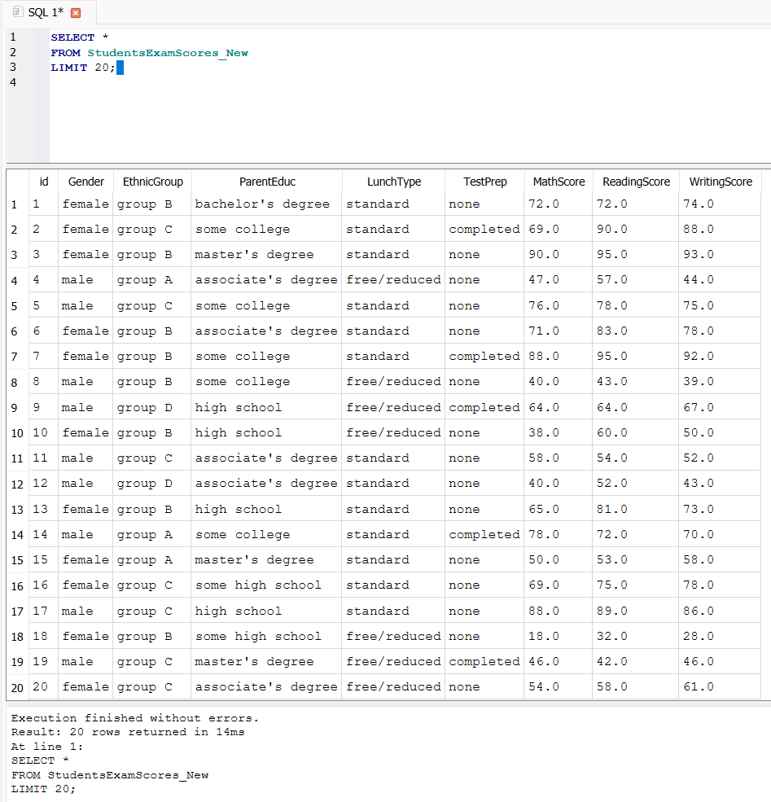

2. **Checking for Null or Missing Values**
   - Identified and addressed any missing or incomplete data.
     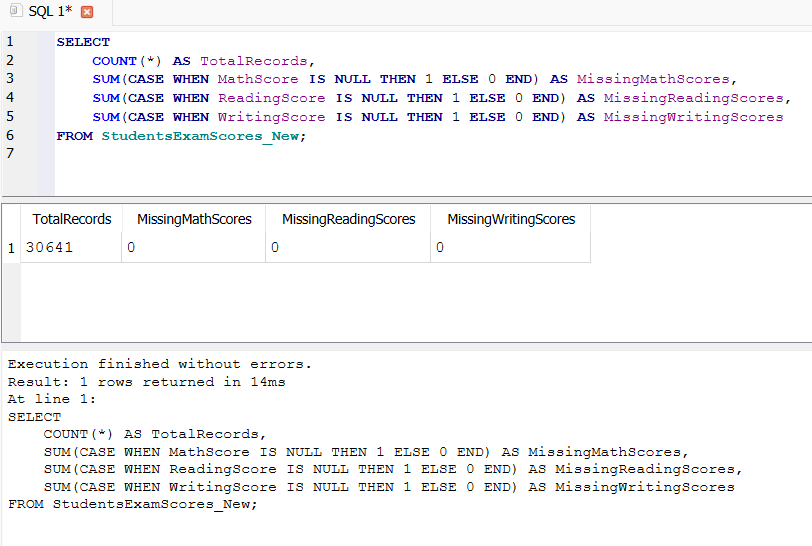

3. **Summarizing Data**
   - Examined the proportion of students who completed test preparation (approximately ⅓ completed).
     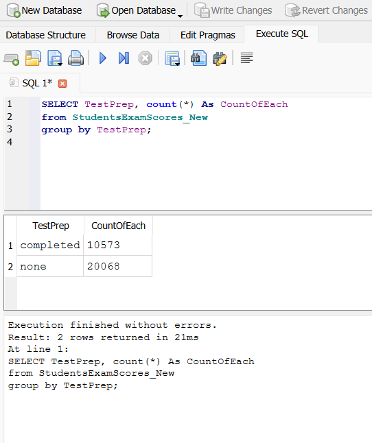

4. **Analyzing Data**
   - Analyzed average scores for students who completed test prep vs. those who didn’t.
     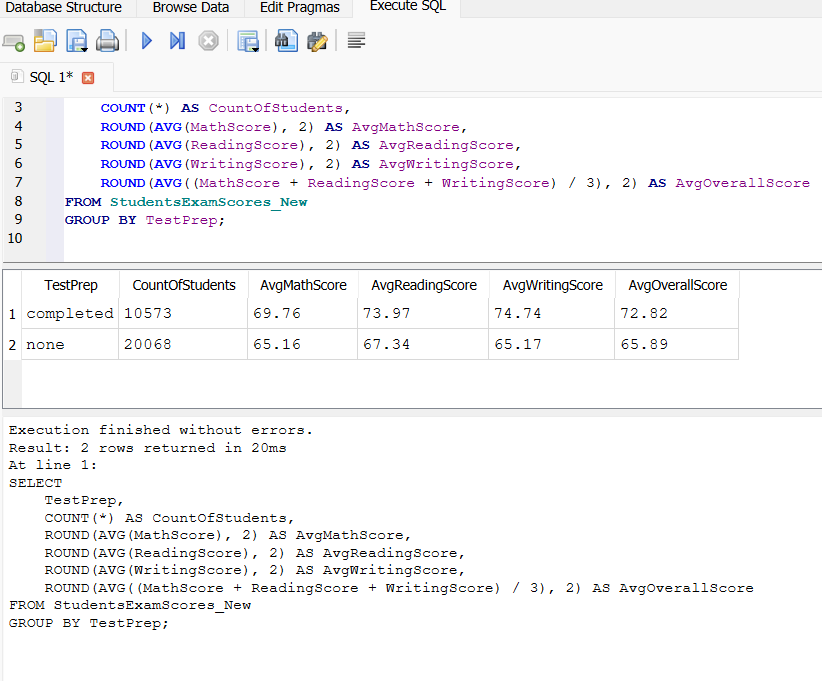
   - Investigated gender performance per exam and overall.
     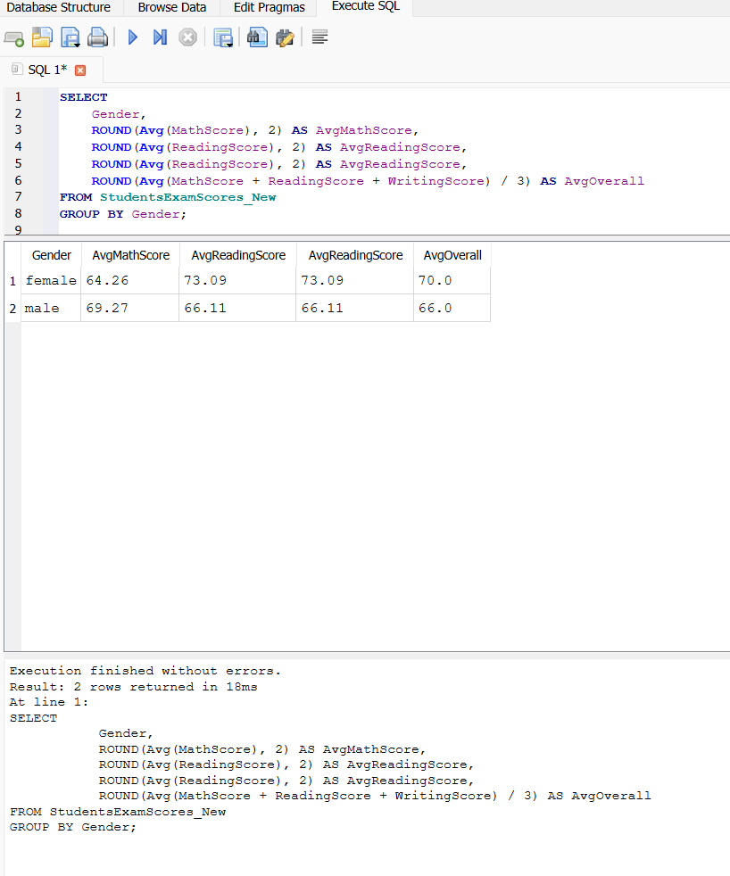
   - Explored the impact of lunch type, finding that students with free/reduced lunch tended to perform lower.
     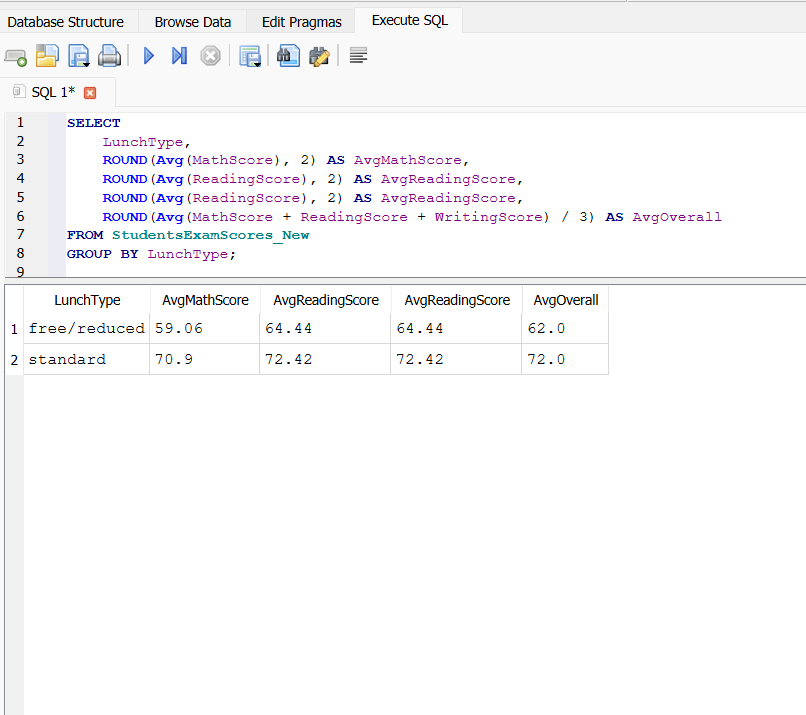
   - Also, viewed Gender and Lunch Type to see if anything changed.
     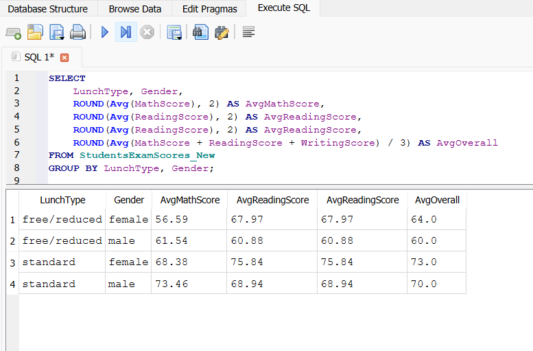
   - Assessed parental education and its correlation with student performance, showing higher scores for students whose parents had higher education levels and even higher scores for completed test prep.
     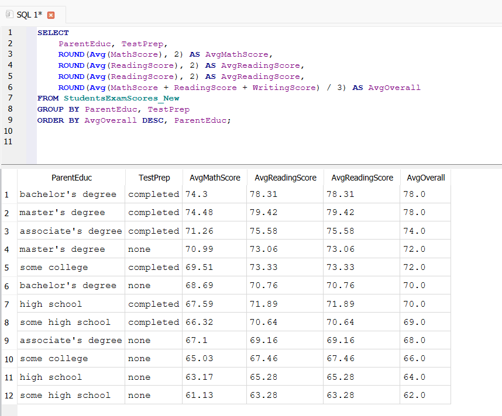

5. **Advanced/Additional Queries**
   - Identified the top 10 performers across all categories.
     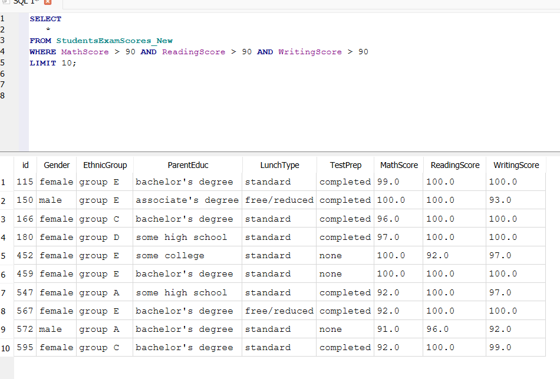
   - Explored correlations between ethnic groups and test preparation status.
     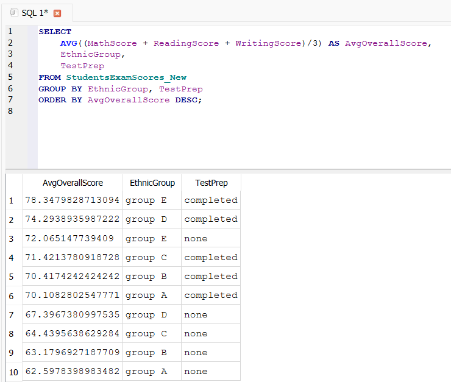

---

## Tools & Technologies Used
1. **SQLite**: 
   - For storing and querying the dataset.
   - Practiced SQL operations such as SELECT, GROUP BY, ORDER BY, and aggregation functions like AVG().
2. **SQLite DB Browser**: 
   - For database creation and running SQL queries.
3. **Microsoft Excel**: 
   - For creating data visualizations and summarizing results.
4. **Git & GitHub**: 
   - To organize and showcase the project.

---

## Visualizations
1. **Impact of Test Preparation on Scores by Parental Education**:
   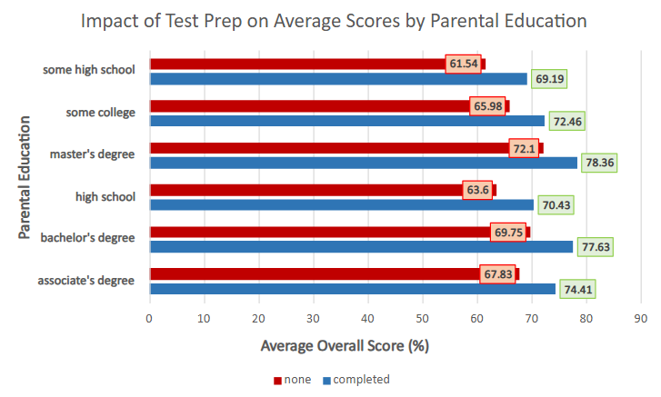
   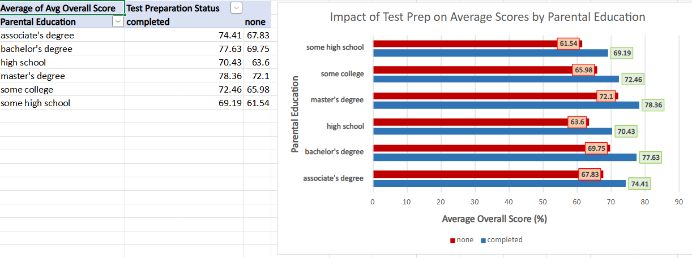

---

## Key Insights
1. **Parental Education**:
   - Students whose parents have higher education levels tend to perform better overall.
2. **Test Preparation**:
   - Completing test preparation significantly improves average scores across all demographics.
3. **Performance Gaps**:
   - There are noticeable gaps in performance based on parental education and test prep status.

---

## Advanced Queries (Showcase)
1. **Top 10 Performers**:
   - Identified students scoring above 90 in all three subjects.
2. **Ethnic Groups and Test Prep**:
   - Found correlations between ethnic groups and test preparation status, offering insights into targeted intervention opportunities.

---

## What I Learned
1. **SQL**:
   - How to use aggregation functions (`AVG`, `SUM`, etc.) to analyze data.
   - The importance of grouping (`GROUP BY`) to summarize data by categories.
   - Writing efficient queries to extract actionable insights.
   - Leveraging (`CASE WHEN`) to apply additional logic within queries. It's like in if/else statement in programming.
2. **Data Visualization**:
   - How to create meaningful charts that clearly communicate insights.
   - Formatting and styling visualizations for better readability.
3. **Data Storytelling**:
   - Structuring a project to highlight key findings and present them professionally.

